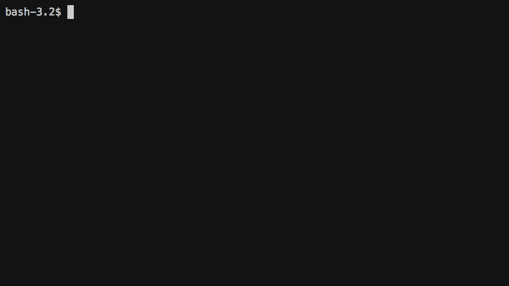

# Brain Games

[](https://codeclimate.com/github/jnk-hub/brain-games/maintainability)
[](https://travis-ci.org/jnk-hub/brain-games)
[](https://github.com/prettier/prettier)

Set of mini-games for CLI

games in set:

- brain-even
- brain-calc
- brain-gcd
- brain-balance
- brain-progression
- brain-prime

## Install

```
npm install -g jnk-brain-games
```

## Usage

Enter name of the game in console

For example:

```
brain-calc
```


